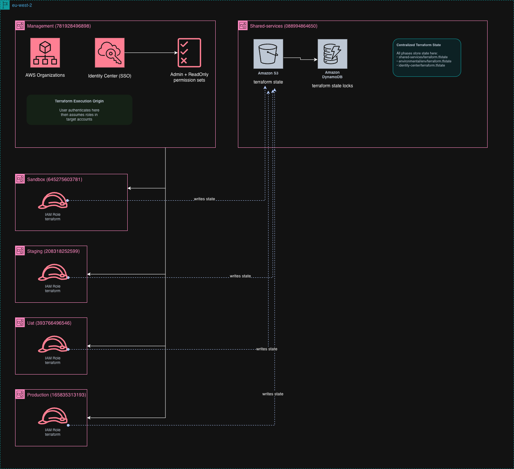

# AWS Multi-Account SSO with Terraform

**Production-grade AWS multi-account architecture with IAM Identity Center (SSO), following enterprise IaC patterns, with zero monthly cost.**

[](https://www.terraform.io/)
[](https://aws.amazon.com/)
[](plans/phase-4-validation.md#cost-verification)

---

## What This Does

**Single SSO URL** → **4 AWS Accounts** × **2 Permission Sets** = **8 Access Options**

Login once at `https://d-<id>.awsapps.com/start` to access:
- **sandbox** (Admin, ReadOnly)
- **staging** (Admin, ReadOnly)
- **uat** (Admin, ReadOnly)
- **production** (Admin, ReadOnly)

**Backend**: Centralized Terraform state in shared-services account (S3 + DynamoDB)
**Encryption**: SSE-S3 (FREE) not SSE-KMS
**Cost**: $0/month (100% free tier eligible)

---

## Architecture



**Diagrams available in [`diagrams/`](diagrams/)**:
- `aws-multi-account-architecture.drawio.png` - Visual diagram
- `aws-multi-account-architecture.drawio.xml` - Editable (draw.io)
- `aws-multi-account-flow.mmd` - Mermaid text-based flow

---

## Project Structure

```
aws-multi-account/
├── README.md                          # This filestep-by-step guide
├── CLAUDE.md                          # Claude Code agent instructions
├── .gitignore                         # Protects sensitive files
├── state.conf                         
│
├── terraform/
│   ├── environmental/                     
│   │   ├── main.tf                   # S3, DynamoDB, IAM role
│   │   ├── providers.tf              # AWS provider + assume_role
│   │   ├── locals.tf                 # project_short_name, tags
│   │   ├── terraform.tf              # required_version: 1.13.4
│   │   ├── data.tf                   # Data sources
│   │   ├── variables.tf              # Input variables
│   │   ├── outputs.tf                # Generates state.conf
│   │   └── terraform.tfvars          # Config values (gitignored)
│   │
│   ├── accounts/                      #
│   │   ├── main.tf                   # aws_organizations_account
│   │   ├── providers.tf              # AWS provider + default_tags
│   │   ├── locals.tf                 # Account mappings
│   │   ├── terraform.tf              # Backend S3 + version 1.13.4
│   │   ├── data.tf                   # Organizations data
│   │   ├── variables.tf              # Account configs
│   │   ├── outputs.tf                # Account IDs for Phase 3
│   │   └── terraform.tfvars          # Config values (gitignored)
│   │
│   └── identity-center/               # Phase 3: IAM Identity Center
│       ├── main.tf                   # High-level orchestration
│       ├── users.tf                  # aws_identitystore_user
│       ├── groups.tf                 # aws_identitystore_group
│       ├── permission-sets.tf        # aws_ssoadmin_permission_set
│       ├── account-assignments.tf    # aws_ssoadmin_account_assignment
│       ├── providers.tf              # AWS provider
│       ├── locals.tf                 # SSO mappings
│       ├── terraform.tf              # Backend S3 + version 1.13.4
│       ├── data.tf                   # SSO instance data
│       ├── variables.tf              # SSO ARNs, account IDs
│       ├── outputs.tf                # User/group/permission set details
│       └── terraform.tfvars          # Config values (gitignored)
```

---

## Key Features

### Zero-Cost Architecture
- ✅ **SSE-S3 Encryption**: FREE (vs SSE-KMS ~$1/month)
- ✅ **S3 Free Tier**: < 50GB storage (state files ~100KB)
- ✅ **DynamoDB Free Tier**: PAY_PER_REQUEST model
- ✅ **IAM Identity Center**: $0 for AWS account assignments

### Enterprise Patterns
- ✅ **Centralized State**: state.conf pattern with assume_role
- ✅ **Default Tags**: yourorg:terraform_stack, yourorg:environment, yourorg:managed_by
- ✅ **External ID**: Cross-account security on assume roles
- ✅ **Terraform 1.13.4**: Production-stable version

### Security & Compliance
- ✅ **Least Privilege**: ReadOnly permission set enforces read-only
- ✅ **MFA-Ready**: Can enforce MFA on permission sets
- ✅ **Bucket Versioning**: State history recovery
- ✅ **Public Access Blocked**: S3 bucket hardened
- ✅ **GitOps Ready**: Sensitive files gitignored

### Production-Ready
- ✅ **Idempotent**: Re-runnable terraform apply
- ✅ **Documented**: Each phase has troubleshooting, rollback, verification

---

## Security Features

### Encryption at Rest
- S3 bucket: SSE-S3 (AES-256)
- DynamoDB: Encrypted at rest (default)
- In-transit: TLS 1.2+

### Access Control
- Permission sets enforce least privilege
- ReadOnly boundary prevents writes
- Admin role for privileged operations

## Usage Examples

Flow:
- I authenticate to management account (781928496898) with awsclifranco-admin profile.
- Terraform calls AWS STS AssumeRole API
- AWS checks if management account is trusted in the terraform role's trust policy.
- AWS returns temporary credentials (access key, secret key, session token) - valid 1 hour
- Terraform uses temp credentials to make API calls as if it's in shared-services account
- After 1 hour, credentials expire - must assume role again
- 
Trust Policy (in target account's IAM role):
{
  "Principal": {
    "AWS": "arn:aws:iam::781928496898:root"  # Management account
  }
}

### Web Access (SSO Portal)
1. Navigate to `https://d-<id>.awsapps.com/start`
2. Login as `awsclifranco`
3. Click **sandbox** → **Admin** → **Management console**
4. AWS Console opens with admin access

### CLI Access (Programmatic)
```bash
# Login to SSO
aws sso login --profile sandbox-admin

# Verify identity
aws sts get-caller-identity --profile sandbox-admin
# Output: sandbox account ID

# Use any AWS service
aws s3 ls --profile sandbox-admin
aws ec2 describe-instances --profile sandbox-admin --region eu-west-2
```